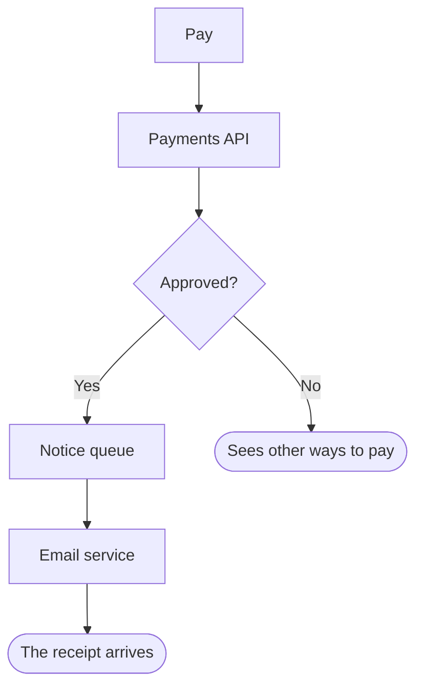

# Get the receipt

After tapping [Pay](../elementos.md#el-boton-pagar), the receipt arrives by email without making the person wait.

```mermaid
flowchart TD
    T[Pay] --> A[Payments API]
    A --> G{Approved?}
    G -->|Yes| Q[Notice queue]
    Q --> C[Email service]
    C --> F([The receipt arrives])
    G -->|No| N([Sees other ways to pay])
%% esquema: {"refs":{"A":"api-pagos","C":"servicio-correo","T":"boton-pagar"}}
```
