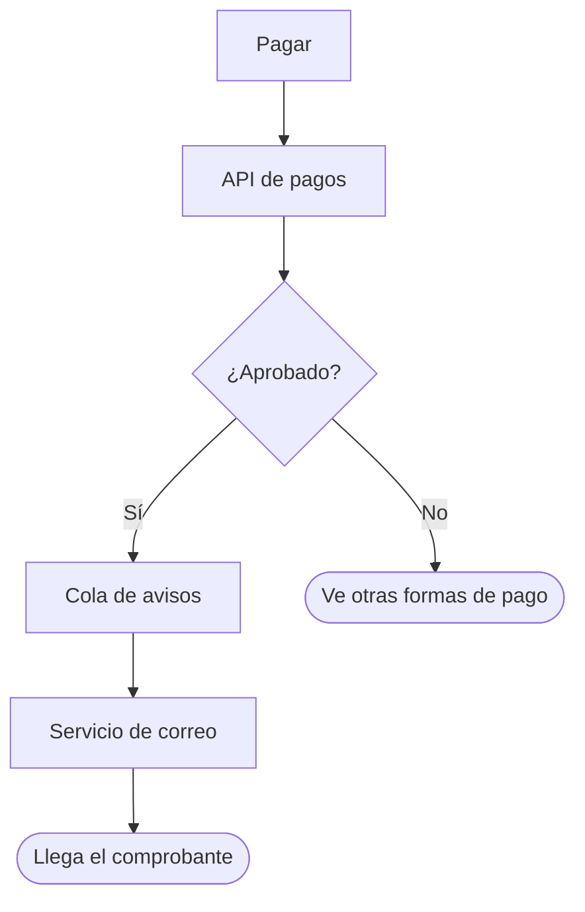

# Recibir el comprobante

Después de tocar [Pagar](../elementos.md#el-boton-pagar), el comprobante llega por correo sin que la persona espere.

```mermaid
flowchart TD
    T[Pagar] --> A[API de pagos]
    A --> G{¿Aprobado?}
    G -->|Sí| Q[Cola de avisos]
    Q --> C[Servicio de correo]
    C --> F([Llega el comprobante])
    G -->|No| N([Ve otras formas de pago])
%% esquema: {"refs":{"A":"api-pagos","C":"servicio-correo","T":"boton-pagar"}}
```
